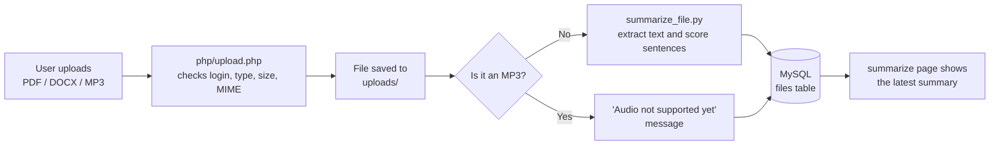

# Summarizer — Smart Lecture Note Summarizer


Summarizer is a web app for students and educators. Upload a lecture file (PDF or Word), and the app extracts its text and returns a short summary of the key sentences in a few seconds. Every upload is saved to the user's account.

The summarizer is **extractive**: it scores the sentences of the document and returns the most important ones. It does not rewrite the text or use a machine-learning model.

---

## Table of contents

- [Features](#features)
- [Screenshots](#screenshots)
- [How it works](#how-it-works)
- [Tech stack](#tech-stack)
- [Project structure](#project-structure)
- [Database](#database)
- [Getting started](#getting-started)
- [Usage](#usage)
- [Security](#security)
- [Known limitations and roadmap](#known-limitations-and-roadmap)
- [Authors](#authors)
- [License](#license)

---

## Features

- **User accounts:** sign up and log in with session-based authentication and hashed passwords.
- **File upload:** PDF, DOCX, and MP3 files up to 10 MB, with extension and MIME-type validation.
- **Automatic summaries:** text is extracted from PDF (PyPDF2) and DOCX (python-docx), then summarized with a word-frequency algorithm built on NLTK.
- **History in the database:** each upload, its file type, and its summary are stored per user.
- **Latest summary view:** the Summarize page shows the summary of your most recent upload.
- **Responsive, pink-themed UI** built with Tailwind CSS: Home, About, Why Us, Contact, Login, Register, and Summarize pages.

> MP3 files are accepted by the upload form, but audio summarization is not implemented yet.

---

## Screenshots


## How it works



**Summarization algorithm** (`summarize_file.py`):

1. Extract the raw text from the PDF or DOCX file.
2. Split the text into sentences with `sent_tokenize`.
3. Split the text into lowercase words and keep only alphanumeric tokens.
4. Count how often each word appears (`FreqDist`).
5. Score each sentence by summing the frequencies of the words it contains.
6. Return the top 3 sentences as the summary.

PHP calls the Python script with `shell_exec`, reads what the script prints, and stores it in the database.

---

## Tech stack

| Layer | Technology |
|---|---|
| Frontend | HTML5, [Tailwind CSS](https://tailwindcss.com/) (CDN), custom CSS, vanilla JavaScript |
| Backend | PHP 8 (`mysqli`, sessions) |
| Summarizer | Python 3.12, PyPDF2, python-docx, NLTK |
| Database | MySQL / MariaDB (database name: `freesum`) |
| Local server | XAMPP (Apache + MariaDB) |

---

## Project structure

```
.
├── Database/              # SQL dump of the `freesum` database
├── css/
│   └── style.css
├── icons/                 # UI icons (pdf, docx, audio, email, password, user, upload, ...)
├── images/                # logo, hero and feature images
├── js/
│   └── main.js            # icon and logo animations
├── php/
│   ├── db.php             # MySQL connection
│   ├── register.php       # create account
│   ├── login.php          # log in, start session
│   ├── upload.php         # validate upload, run the summarizer, save to DB
│   └── get_latest_summary.php
├── uploads/               # uploaded files (not committed)
├── summarize_file.py      # text extraction and summarization
├── index.html
├── about.html
├── why-us.html
├── contact.html
├── login.html
├── register.html
└── summarize.html
```

---

## Database

Database name: `freesum`

**`users`**

| Column | Type | Notes |
|---|---|---|
| `id` | INT, PK, auto-increment | |
| `name` | VARCHAR(100) | |
| `email` | VARCHAR(100) | Unique |
| `password` | VARCHAR(255) | Hash from `password_hash()` |
| `created_at` | TIMESTAMP | |

**`files`**

| Column | Type | Notes |
|---|---|---|
| `file_id` | INT, PK, auto-increment | |
| `user_id` | INT, FK to `users.id` | |
| `file_name` | VARCHAR(255) | |
| `file_type` | VARCHAR(10) | `pdf`, `docx`, or `mp3` |
| `summary` | TEXT | Generated summary |
| `uploaded_at` | TIMESTAMP | |
| `created_at` | DATETIME | Used to find the latest summary |

---

## Getting started

### Prerequisites

- [XAMPP](https://www.apachefriends.org/) (or any Apache + PHP 8 + MySQL/MariaDB stack)
- Python 3.10 or newer, available on your machine

### Installation

1. **Clone the repository** into your web server folder (`htdocs/` with XAMPP):
   ```bash
   git clone https://github.com/<your-username>/<your-repo>.git
   ```

2. **Create the database and import the dump:**
   ```sql
   CREATE DATABASE freesum CHARACTER SET utf8mb4 COLLATE utf8mb4_general_ci;
   ```
   Then import the SQL file from the `Database/` folder with phpMyAdmin.

3. **Check the database settings** in `php/db.php`. The defaults match XAMPP:
   ```php
   $host = "localhost";
   $username = "root";
   $password = "";
   $dbname = "freesum";
   ```

4. **Install the Python dependencies:**
   ```bash
   pip install PyPDF2 python-docx nltk
   ```

5. **Download the NLTK data once** (so the script does not need internet at runtime):
   ```bash
   python -m nltk.downloader punkt punkt_tab stopwords
   ```

6. **Set the Python path** in `php/upload.php`. It is currently hard-coded for one machine, so change it to your own Python executable:
   ```php
   $pythonPath = "C:\\Path\\To\\Python312\\python.exe";
   ```

7. **Make sure the `uploads/` folder exists** and is writable by Apache.

8. **Serve `summarize.html` as PHP.** This page contains PHP code to show the latest summary. Either rename it to `summarize.php` and update the links (and the redirects in `php/upload.php`), or tell Apache to run `.html` files through PHP.

9. **Open the app:**
   ```
   http://localhost/<your-folder>/index.html
   ```

---

## Usage

1. Open the site and click **Create Account**, then log in.
2. Go to **Summarize** and choose a PDF or DOCX file.
3. Click **Get Summary**.
4. The summary of your latest upload appears at the bottom of the page.

---

## Security

What the app already does:

- Passwords are stored with `password_hash()` and checked with `password_verify()`.
- All database queries use prepared statements.
- Uploads are limited to 10 MB and checked by extension and MIME type.
- Output shown on the Summarize page is escaped with `htmlspecialchars()`.
- Python is called with `escapeshellarg()` around the script and file path.

Things to improve before a public deployment: CSRF tokens on forms, random file names for uploads, a logout page, and moving the database credentials out of the repository.

---

## Known limitations and roadmap

- **Audio files:** MP3 upload works, but there is no speech-to-text step yet. An idea is to add a transcription model or service and pass the transcript to the same summarizer.
- **Scanned PDFs:** PDFs that contain only images return no text. Adding OCR (for example Tesseract) would fix this.
- **Language support:** `sent_tokenize` uses English rules by default. For Turkish or other languages, pass the `language` argument and use the matching stopword list.
- **Scoring quality:** words are matched as substrings, stopwords are not removed, and the selected sentences are returned in score order instead of document order. Removing stopwords, matching whole words, and sorting by position would give cleaner summaries.
- **Error handling:** the script downloads NLTK data on every run, and `upload.php` merges stdout and stderr (`2>&1`) and marks any output containing the word "Error" as a failure. When the machine is offline, the download warnings can make a valid summary be reported as failed. Downloading the data once (see installation step 5) and reading stdout separately fixes this.
- **Configuration:** the Python path is hard-coded, and `Uploads` / `uploads` are written with different capitalization, which breaks on case-sensitive systems such as Linux.
- **Duplicate file names:** a new upload with the same name overwrites the previous file.
- **Latest summary endpoint:** `php/get_latest_summary.php` depends on a `file_uploaded` session flag that `upload.php` never sets.
- **Contact page:** the form is a static mock-up and is not connected to a backend.
- **More ideas:** a page with the full summary history, adjustable summary length, export to PDF or TXT, and a proper abstractive summarizer.

---


---

## License

Add a license file (for example MIT) to the repository root and mention it here.
